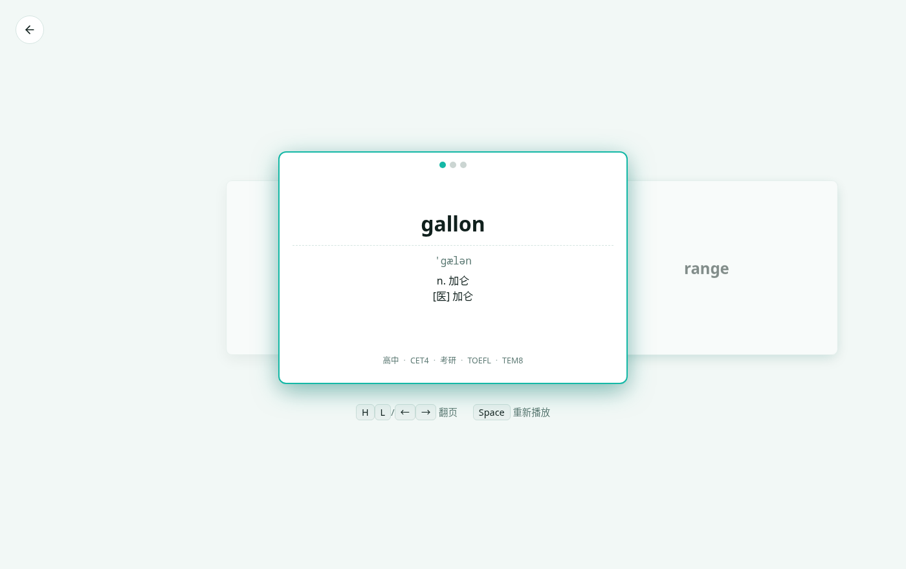
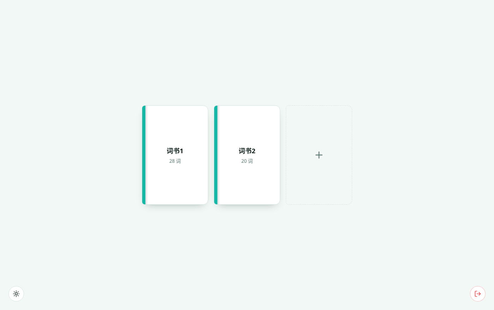
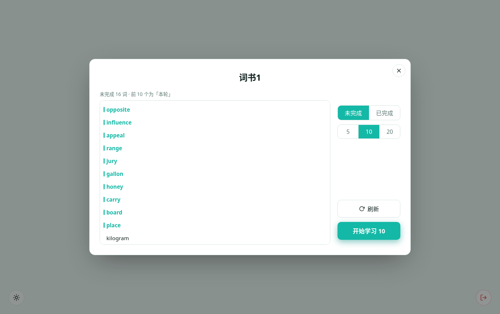

# Vocab Cards

一个用 **React + Vite + TypeScript** 写的背单词单页应用。

核心理念：**用户只管翻**。按 tag 组成「词书」，点开就给你 20 个词，三卡片环形滑动地过一遍；看腻了点「换一轮」再来一批。没有打卡、没有完成度、没有进度压力。



## 目录

- [功能](#功能)
- [页面流程](#页面流程)
- [快捷键](#快捷键)
- [本地存储](#本地存储)
- [数据](#数据)
- [开发](#开发)
- [项目结构](#项目结构)

## 功能

### 登录 `/login`

- 只有一个「登录」按钮，纯前端 mock（无后端）
- 登录态写 `localStorage`，未登录访问其他页面会重定向回 `/login`

### 主页 `/` · 词书架



- 中间是词书区，每本书显示**书名**（词书1、词书2…）和**词数**
- 点 `+` 新建词书：弹出 tag 选择窗口
  - 每个 tag 点一下 = **包含**（青绿），再点 = **排除**（红 + 删除线），再点取消
  - 过滤规则：**排除优先**；没选包含 tag 就从全部词开始；包含之间是 **OR**
  - **不能创建 tag 组合相同的词书**
- 词书卡片右上角 `×` 删除，**二次确认**（变红 ✓ 后再点一次才删）
- 左下角主题切换（自动 / 亮 / 暗），右下角退出登录

### 词书弹窗



- **左栏**：这一轮要学的词（可滚动）
- **右栏**：`换一轮` + `开始学习`
- 每轮从词书里**随机推 20 个词**（不足 20 就给全部），词序也是随机的
- 点「换一轮」重掷；顺序按词书持久化，**重开不重排**
- 点「开始学习」直接进 `/study`

### 学习页 `/study`

- 左 / 中 / 右三张卡，中间大两边小，**环形无缝滑动**（首尾相接）
- 默认只显示单词；`Space` 展开后显示音标、释义、tags，并朗读音频；再按只重播
- 卡片顶部三个小圆记录「展开释义」次数（三进制：绿 → 黄 → 红，最多一个红）
- 悬停光晕按**指针位置**命中（而非 CSS `:hover`），避免翻页后光晕粘在移动的卡片上
- 就只是翻 —— 没有「完成」、没有进度

### 通用

- 明暗主题（跟随系统 / 强制亮 / 强制暗），首屏内联脚本防闪烁
- 状态存 `localStorage`，刷新不丢
- 尊重系统「减少动态效果」

## 页面流程

```
/login ──登录──▶ / ──点词书──▶ 词书弹窗 ──开始学习──▶ /study
                 └─点 + ─▶ tag 选择弹窗 ──创建词书──▶ 回到 /
```

| 路径 | 页面 |
| --- | --- |
| `/login` | 登录 |
| `/` | 主页 · 词书架 |
| `/study` | 学习 |
| `*` | 重定向到 `/` |

## 快捷键

| 键 | 作用 |
| --- | --- |
| `H` / `←` | 上一张 |
| `L` / `→` | 下一张 |
| `Space` | 显示释义 + 朗读；已显示则重播 |

鼠标：点左 / 右卡翻页，点中间卡 = `Space`。

## 本地存储

| key | 内容 | 范围 |
| --- | --- | --- |
| `vocab-auth` | 登录态 | — |
| `vocab-theme` | 主题 `auto` / `light` / `dark` | — |
| `vocab-books` | 词书列表 | — |
| `vocab-filter` | 本次进入学习用的筛选条件 | — |
| `vocab-session` | 当前这一轮要学的词 | — |
| `vocab-reveal-counts` | 每个词「展开释义」的次数 | **全局**（所有词书互通） |
| `vocab-centers` | 每轮看到第几张 | 按轮 |
| `vocab-round-orders` | 每轮的随机顺序 | 按词书 |

## 数据

- 词条在 [`src/data/words.ts`](src/data/words.ts)：**60 个词**，覆盖 19 个 tag（每个 tag 至少 5 张）、纯 `a-z` 单词、无短语
- 词条由上层 `words.json`（ECDICT 风格：`phonetic / definition / tags / audio_file`）筛选生成
- 音频在 `public/audio/`（60 个 mp3，约 720 KB），通过 `/audio/<audio_file>` 引用

## 开发

```bash
npm install
npm run dev        # 开发
npm run typecheck  # 类型检查（tsc -b）
npm run build      # 类型检查 + 打包
npm run preview    # 预览打包结果
```

技术栈：React 18 · TypeScript 5 · Vite 5 · react-router-dom 6，零 UI 库。

## 项目结构

```
src/
├── main.tsx                入口
├── App.tsx                 路由 + 登录守卫
├── index.css               全部样式
├── data/
│   └── words.ts            词条数据
├── lib/                    领域逻辑 + 持久化
│   ├── storage.ts          localStorage 统一封装（读写 + 校验）
│   ├── tags.ts             tag 排序 / 收集
│   ├── filter.ts           tag 筛选规则
│   ├── books.ts            词书存取
│   ├── session.ts          当前轮次存取
│   ├── progress.ts         展开次数 + 位置
│   ├── rounds.ts           每轮的随机顺序
│   ├── theme.ts            主题模式
│   └── auth.ts             登录态
├── components/             跨页面共享组件
│   ├── ThemeToggle.tsx     主题切换按钮
│   └── BackButton.tsx      左上角返回按钮
└── pages/
    ├── Login.tsx           /login 登录
    ├── Home.tsx            /  词书架
    ├── Study.tsx           /study 三卡学习（只管翻）
    └── home/
        ├── BookDialog.tsx  词书弹窗（本轮 20 词 / 换一轮 / 开始）
        └── TagPicker.tsx   新建词书的 tag 选择弹窗
```
