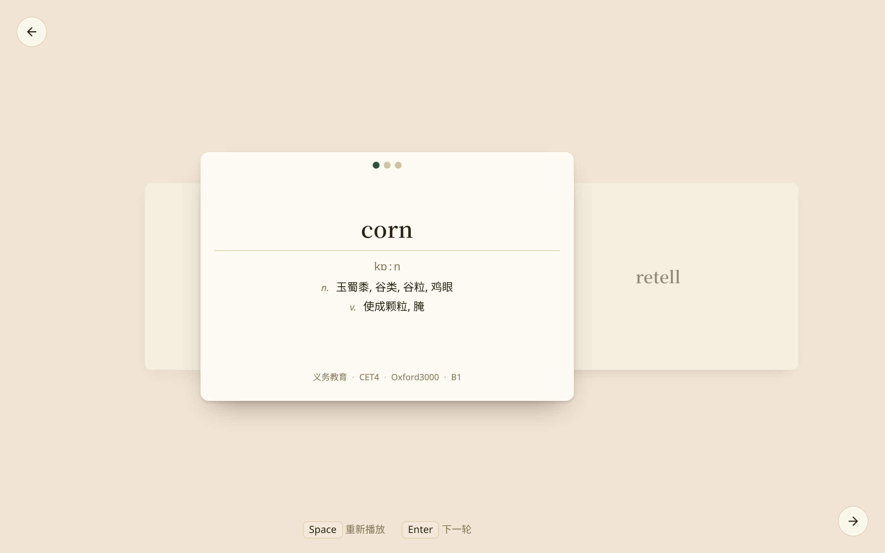
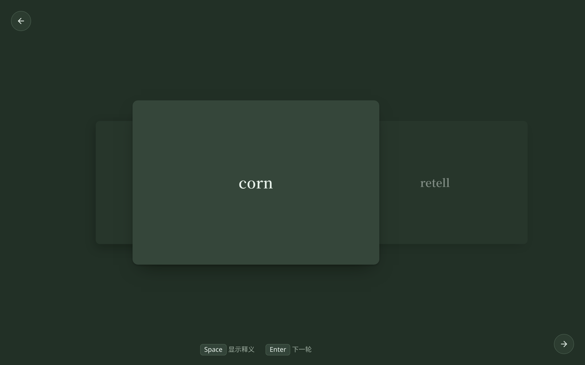

# 洗牌 · 翻牌

[English](docs/README.en.md)

抽认卡背单词：洗牌抽卡，翻牌看释义。





## 快速开始

```bash
npm install
npm run dev      # 本地开发
npm run build    # 生产构建
npm run preview  # 预览构建产物
```

## License

[MIT](LICENSE)
