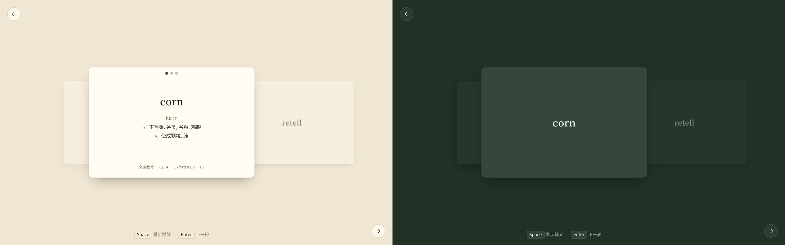

<h1 align="center">洗牌 · 翻牌</h1>

<p align="center"><a href="../README.md">English</a></p>

抽认卡背单词：洗牌抽卡，翻牌看释义。



## 洗牌

## 换牌

## 翻牌

## 快速开始

```bash
npm install
npm run dev      # 本地开发
npm run build    # 生产构建
npm run preview  # 预览构建产物
```

## 数据

词库来自配套仓库 [imfiiish/wordlists](https://github.com/imfiiish/wordlists)：

- `data/en/` — 英文词表（CET4/6、Oxford 3000/5000、课标、CEFR）
  - `categories.json` — 词 → 标签
  - `definitions.json` — 音标 + 中文释义（取自 [ECDICT](https://github.com/skywind3000/ECDICT)，MIT）
- `data/zh/` — 中文词表（HSK 词汇/汉字）
  - `definitions.json` — 拼音 + 英文释义（取自 [CC-CEDICT](https://www.mdbg.net/chinese/dictionary?page=cc-cedict)，CC BY-SA 4.0）
  - `字义.json` — 汉字英文 gloss（取自 [Unihan](https://www.unicode.org/Public/UCD/chart/) kDefinition，Unicode License V3）
- 音频文件不入库，放在 `public/audio/`（缺失时自动静音）。中文音频可用 `npm run audio:zh` 生成（edge-tts）。

两种学习方向由界面语言决定，tag 不混：中文界面学英文（CET/Oxford），English 界面学中文（HSK）。
中文词条可通过 `npm run build:zh-seed` 生成 `server/seed/words_zh.sql` 后随 seed 入库。

词表内容版权归原作者 / 出版机构（Oxford University Press、相关教育机构等），仅用于学习研究；商用请自行取得授权。
CC-CEDICT 部分采用 CC BY-SA 4.0，Unihan 部分采用 Unicode License V3。

## License

[MIT](../LICENSE)
